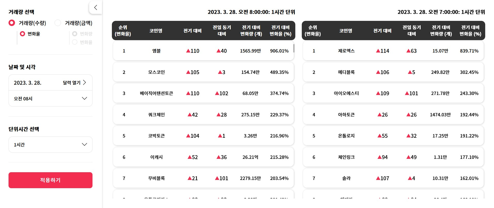

## I. 프로젝트 개요  

업비트 원화마켓에서 거래되는 코인들의 거래량 변화를 한 눈에 볼 수 있도록 정리한 웹사이트입니다.  
  
**웹사이트 링크: [🔗웹사이트](https://junbit.vercel.app/ 'https://junbit.vercel.app/')**  
  
---    
## II. Quick Features  
- 매 시 정각 기준 데이터 확인이 가능합니다
- 1시간/2시간/4시간/12시간/24시간(1일) 단위로 데이터 확인이 가능합니다.
- 거래량 변화 순위 모아보기  
  - 거래 <strong>수량</strong> 기준/거래 <strong>금액</strong> 기준 확인이 가능합니다.
  - 거래 금액의 경우 <strong>변화량, 변화율</strong> 순위 변동 확인이 가능합니다.  
   
  

    
- 각 코인별 거래량 순위 변화 확인하기
  - 표의 각 행을 클릭하면 해당 코인의 차트 페이지로 이동합니다.
  - 거래 수량의 경우, 상단 차트에서는 단위시간별 거래량 합계 순위, 거래량 변화율 순위 확인이 가능합니다
  - 하단 차트에서는 단위시간별 거래량 합계, 거래량 합계 변화율 확인이 가능합니다.
  - 거래 금액의 경우, 상기 자료에 더해, 거래량 변화량 순위 및 변화량 확인이 가능합니다.
  - 각 꼭짓점에 마우스를 갖다대면 툴팁이 나타납니다.
   
  
